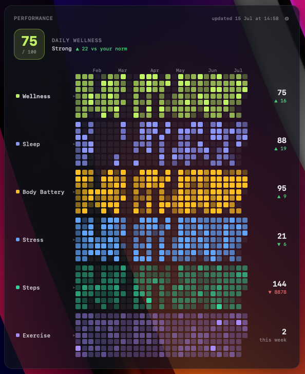
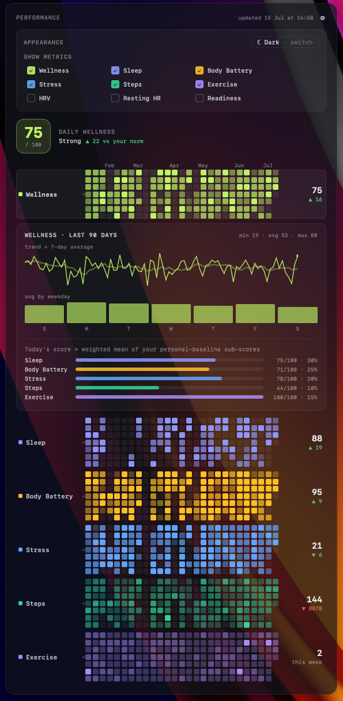
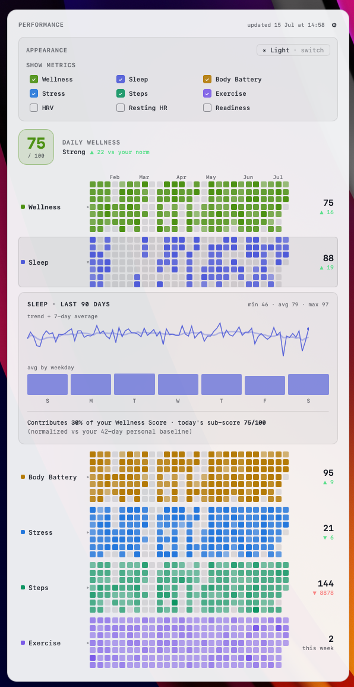

# Garmin Performance Heatmaps for macOS

[](LICENSE)

A desktop widget ([Übersicht](https://tracesof.net/uebersicht/)) that turns your
Garmin Connect data into GitHub-style contribution heatmaps — one row per metric —
plus a single evidence-based **Daily Wellness Score**. Click any row to drill into
its trend, and pick which metrics and which theme you want.

Two parts:

- **`garmin_fetch.py`** — logs into Garmin Connect, pulls your daily metrics, computes
  the wellness score, and writes `~/.garmin_heatmap/data.json`. Runs incrementally and
  on a schedule via `launchd`.
- **`index.jsx`** — the Übersicht widget that renders that JSON.

Credentials are stored in the **macOS Keychain**, never in a file or in this repo.

<p align="center">
  
  &nbsp;
<p align="center"><sub>Dark mode (default view)</sub></p>

---

## Features

- **Daily Wellness Score (0–100)** — one number that summarizes recovery + activity,
  normalized against *your own* rolling baseline (see [the method](#the-wellness-score) below).
- **Per-metric heatmaps** — Sleep, Body Battery, Stress, Steps, Exercise, and (optional)
  HRV, Resting HR, Readiness. Brighter = a better day for that metric.
- **Exercise, logged *or* inferred** — counts activities you recorded, and still credits a
  day where Garmin detected real intensity minutes without a logged activity.
- **Click to drill down** — each row expands to a 90-day trend + 7-day average, an
  average-by-weekday chart, and that metric's contribution to your score.
- **Settings panel (⚙)** — choose which metrics to show and switch **light/dark** theme.
  Preferences persist across restarts.

<p align="center">
  
  
  <br>
  <em>Wellness score drill-down settings in dark and light mode.</em>
</p>

---

## Requirements

- macOS
- [Übersicht](https://tracesof.net/uebersicht/) (`brew install --cask ubersicht`, or download and drag to Applications)
- Python 3.9+
- A Garmin Connect account

---

## Quick install

```bash
git clone https://github.com/<you>/garmin_heatmap.git
cd garmin_heatmap
./install.sh
```

`install.sh` creates the virtualenv, installs dependencies, prompts once for your Garmin
email/password (stored in the Keychain via a hidden prompt — never echoed or written to
disk), installs the widget, sets up the twice-daily `launchd` job, and runs the first fetch.

If your account has two-factor auth, the first fetch will prompt once for the code, then
cache tokens so later runs are silent.

> **After installing:** if the widget doesn't appear, grant Übersicht **Screen Recording**
> permission (System Settings → Privacy & Security → Screen Recording) and reopen it —
> macOS requires this for any app that draws on the desktop.

---

## Manual install

<details>
<summary>If you'd rather not run the script</summary>

```bash
# 1. fetcher + venv
mkdir -p ~/.garmin_heatmap
cp garmin_fetch.py run.sh ~/.garmin_heatmap/
chmod +x ~/.garmin_heatmap/run.sh
python3 -m venv ~/.garmin_heatmap/venv
~/.garmin_heatmap/venv/bin/pip install garminconnect curl_cffi ua-generator

# 2. credentials -> Keychain (password prompt is hidden)
security add-generic-password -U -s garmin_heatmap -a email -T /usr/bin/security -w "you@example.com"
security add-generic-password -U -s garmin_heatmap -a "you@example.com" -T /usr/bin/security -w

# 3. widget
mkdir -p ~/"Library/Application Support/Übersicht/widgets/garmin-heatmap.widget"
cp index.jsx ~/"Library/Application Support/Übersicht/widgets/garmin-heatmap.widget/index.jsx"

# 4. launchd (twice daily)
sed "s|__HOME__|$HOME|g" com.garmin.heatmap.plist.template > ~/Library/LaunchAgents/com.garmin.heatmap.plist
launchctl bootstrap gui/$(id -u) ~/Library/LaunchAgents/com.garmin.heatmap.plist

# 5. first fetch
~/.garmin_heatmap/run.sh
```
</details>

---

## The Wellness Score

A single 0–100 number per day, designed to be **transparent and reproducible** (it is a
deterministic formula, not a model). Each component is normalized against *your own*
trailing 42-day baseline — a **personal z-score** — then squashed to 0–100 and combined:

| Component | Signal | Default weight |
|---|---|---|
| Sleep | Garmin sleep score | 0.30 |
| Body Battery | day's peak (recovery) | 0.25 |
| Stress | inverted (calmer = better) | 0.20 |
| Exercise | intensity minutes, bounded* | 0.15 |
| Steps | vs your baseline | 0.10 |

\*Exercise is bounded and never penalizes a rest day — a healthy dose scores well, an
extreme day doesn't run away. Recovery signals (sleep + body battery + calm) intentionally
carry ~75% of the weight, mirroring validated readiness models (Garmin Training Readiness,
Oura, WHOOP) while staying fully tunable.

A day is only scored once at least half of the weighted signal has synced, so a partial
current day (before sleep/body battery arrive) isn't scored from a sliver of data.

Weights, the baseline window, and the exercise target live in the `WELLNESS` block at the
top of `garmin_fetch.py`.

---

## Configuration

- **Which metrics are collected** — the `METRICS` block in `garmin_fetch.py` (`enabled`,
  `direction`, and `group`: `primary` shows by default, `secondary` sits under the widget's
  "more" toggle).
- **Which metrics are shown** — the widget's ⚙ settings panel (persisted per machine).
- **History length** — `DAYS_BACK` in the fetcher; `WEEKS` in `index.jsx` controls how many
  columns the heatmap shows.
- **Colors / theme** — the `COLORS` map and `themeVars()` in `index.jsx`.

---

## Security & privacy

- Your Garmin **email and password live only in the macOS Keychain**. They are never written
  to the launchd plist, the repo, or any file. `run.sh` reads them at runtime and only into
  its own short-lived environment.
- After the first login, Garmin **OAuth tokens** are cached in `~/.garmin_heatmap/tokens/`
  and used for subsequent runs, so the password is rarely needed again.
- Your fetched data (`~/.garmin_heatmap/data.json`), tokens, and the venv are all outside the
  repo and are `.gitignore`d, so cloning/pushing this project never exposes personal data.

---

## Updating & troubleshooting

- **Logs**: `/tmp/garmin_heatmap.log` (the scheduled runs write here).
- **Force a run now**: `~/.garmin_heatmap/run.sh`
- **Reload the schedule**: `launchctl kickstart -k gui/$(id -u)/com.garmin.heatmap`
- **Login breaks after a Garmin change**:
  `~/.garmin_heatmap/venv/bin/pip install --upgrade garminconnect curl_cffi ua-generator`
- **Rate limited (HTTP 429)**: Garmin throttles repeated logins; wait a few minutes. Once
  tokens are cached, runs resume without hitting the login endpoint.
- **Widget blank**: grant Übersicht Screen Recording permission (see above).

---

## Notes

- Field names in Garmin's responses vary by device/firmware; the extractors try several keys
  and store nothing (an empty cell) when a metric is genuinely missing for a day.
- This project talks to Garmin through the community
  [`garminconnect`](https://pypi.org/project/garminconnect/) library, which uses the same
  OAuth flow as Garmin's own apps. It is not affiliated with or endorsed by Garmin.

## License

[MIT](LICENSE)
